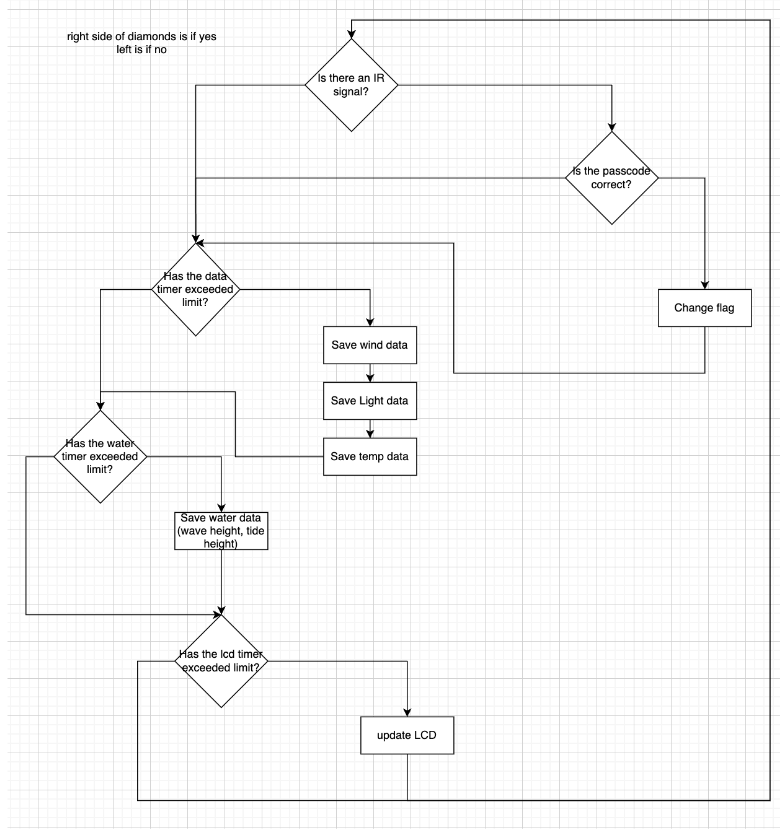
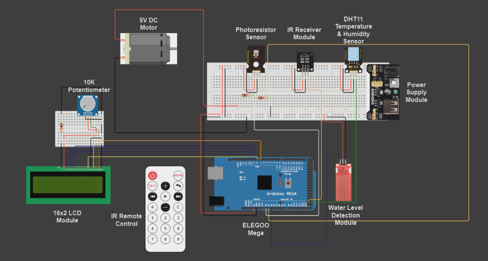

# IEEE SoutheastCon 2024 Software Competition: Beach Forecast Device

This repository contains the project documentation and prototype for the Beach Forecast Device developed by Abdala Jabase, Brian Luckett, and Adam Moore from Christian Brothers University for the IEEE SoutheastCon 2024 Software Competition.

## Theoretical Project Description

The Beach Forecast Device is designed to monitor various parameters of a beach environment, including tide and wave height, water temperature, UV intensity, air temperature, humidity, and the status of the beach warning flag. Data collection is facilitated by a network of monitoring stations, allowing beachgoers to access real-time information remotely. The device aims to enhance safety for beach visitors by providing accurate and timely forecasts and contributing to ocean and environmental research efforts.

## Prototype Description

The prototype demonstrates key features of the Beach Forecast Device using sensors such as Temperature/Humidity, IR, Light, Water Level, and a DC motor. The prototype simulates data collection and transmission, as well as the display of information on an LCD screen. Although the prototype may not fully represent the final product, it showcases the core functionalities and potential applications of the device.

## Function Block Diagram

## Hardware Schematic

## Requirements Table

| Requirement                                   | Variable                             | Threshold            | Test Result | Pass/Fail |
|-----------------------------------------------|--------------------------------------|----------------------|--------------|-----------|
| Device collects Temperature data              | Temperature (℉)                     | Realistic Value      | 77           | Pass      |
| Device collects Humidity data                 | Relative Humidity (%)                | Realistic Value      | 30           | Pass      |
| Device collects light intensity data          | Light intensity (%)                  | Realistic Value      | 89.32        | Pass      |
| Device collects wind speed data               | Wind speed (MPH)                     | Realistic Value      | 10           | Pass      |
| Device collects water height data             | Wave height (mm) & Tide height (mm) | Realistic Value      | 0.91         | Pass      |
| Device can change flag status                | Ease for beach guard to switch Flag status | Can input flag without too much issues | Quite easy (if quick) | Pass |
| Device can display data on an LCD            | How smooth and clear the data is displayed | Speed of sliding is good, and quality is good | Relatively good | Pass |

## Challenges

The project encountered various challenges during the development of the prototype, including designing a wind sensor, troubleshooting sensor functionality, and managing tasks with Arduino limitations. Overcoming these challenges required creative problem-solving and collaboration among team members.

## Conclusion

Despite facing challenges, the team successfully developed a working prototype of the Beach Forecast Device, demonstrating the feasibility of the concept and its potential benefits for beach safety and environmental research. The project highlighted the application of knowledge gained from Christian Brothers University and served as a rewarding learning experience for the team members.

---

Feel free to explore the repository for more details on the Beach Forecast Device project!
